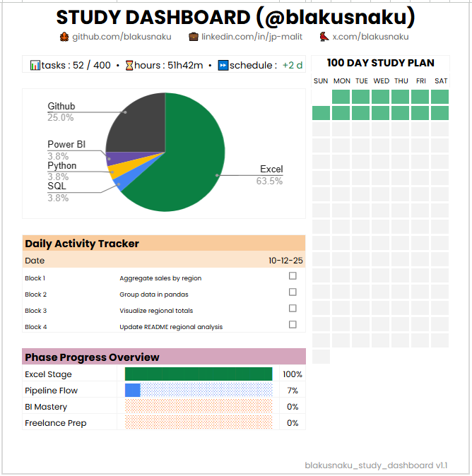

# 📊 Study Dashboard (@blakusnaku)
> Tracking the journey from Excel foundations to full BI integration — SQL → Python → Power BI

---

## 🌐 Live View
> View the live dashboard here (Google Sheets version):  
👉 [Live Dashboard Link](https://docs.google.com/spreadsheets/d/1TLP4skR9L8p8keZBImYdIXdy1Gyl0mBcUqyHPyfwIXE/edit?usp=sharing)

---

---

## 🧭 Version History

### **📅 October 6, 2025 – Initial Concept**
**Theme:** Foundation Planning  
- Conceptualized the dashboard to track daily study blocks (Block 1–4).  
- Decided on Excel as the main environment for early versions.  
- Established goal: build a **100-day measurable learning system**.  

---

### **📅 October 7, 2025 – Core Layout & Metrics**
**Theme:** Structure and Design  
- Added KPI metrics: Total Tasks, Completion %, Total Hours, Schedule Variance.  
- Created the **Daily Activity Tracker** and **16-week GitHub-style grid**.  
- Added **social icons (GitHub, LinkedIn, X)** for branding.  
- Finalized initial layout and color hierarchy.

---

### **📅 October 8, 2025 – Version 1.0**
**Theme:** Official Baseline  
- Completed the first stable version: `blakusnaku_study_dashboard v1.0`.  
- Added **Phase Progress Overview** and final header polish.  
- Locked this as the **official baseline** for future updates.  
> 📍 *Milestone: “Excel Foundations Complete”*

---

### **📅 October 10, 2025 – Version 1.1**
**Theme:** Pipeline Flow + Power BI Focus  
- Refined KPIs into **one-liner metrics** for better space optimization.  
- Added **Tool Usage Pie Chart** and **Phase Progress Overview**.  
- Updated version label → `v1.1`.  
- Reorganized files into **daily folders** for GitHub readability.  
- Shifted focus to **Power BI integration** after realizing client demand.  
- Created first cross-tool project:  
  *🧩 “Day 13 – SQL to Power BI Sales Dashboard”*  
- Merged SQL, Python, and Power BI workflows — foundation for the “Pipeline Flow” phase.  

---

### **📈 Current Stats (as of October 10, 2025)**
| Metric | Value |
|--------|-------|
| Tasks Completed | 52 / 400 |
| Hours Logged | 51h 42m |
| Schedule Variance | +2 days ahead |
| Excel Stage | ✅ 100% |
| Pipeline Flow | 🚀 7% |
| BI Mastery / Freelance Prep | 🔜 Upcoming |

---

### **🧩 Next Focus (v1.2 Goals)**
- Deepen Power BI skills: calculated columns, DAX, relationships.  
- Enhance visual hierarchy and color consistency.  
- Add changelog tracking **directly inside the dashboard**.  
- Continue documenting daily progress through GitHub and LinkedIn reflections.

---

**Version Tag:** `blakusnaku_study_dashboard v1.1`  
**Maintainer:** [@blakusnaku](https://github.com/blakusnaku)  
**Last Updated:** October 10, 2025
