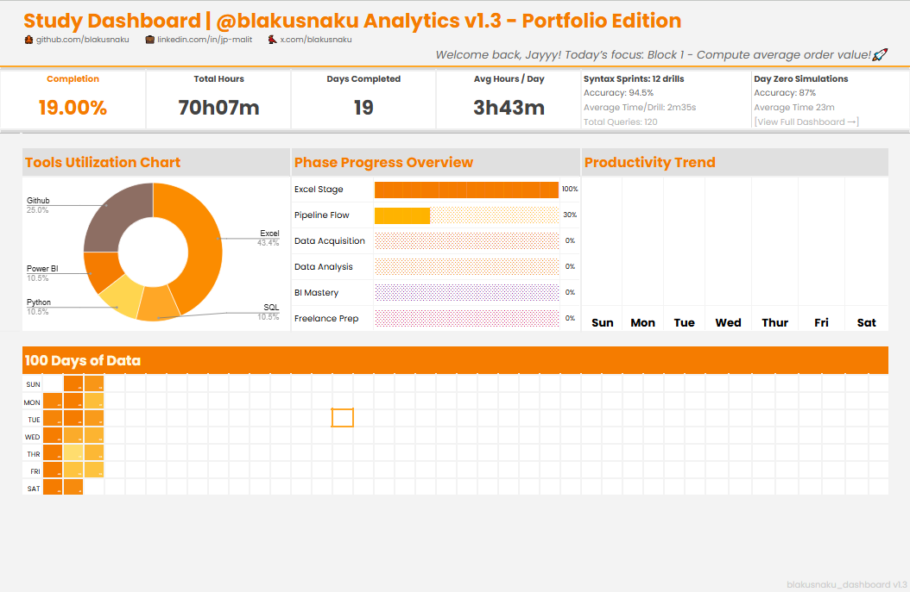

# 📊 Study Dashboard | @blakusnaku Analytics v1.3 – Portfolio Edition
> Tracking the journey from Excel Foundations → SQL → Python → Power BI  
> Building a measurable ecosystem for continuous data growth and portfolio-ready insight  

---

## 🌐 Live Dashboard
📍 **Interactive Version (Google Sheets):**  
👉 [View Live Dashboard](https://docs.google.com/spreadsheets/d/1TLP4skR9L8p8keZBImYdIXdy1Gyl0mBcUqyHPyfwIXE/edit?usp=sharing)

---



---

## 🧭 Overview
The **Study Dashboard** is a live analytics environment documenting my 100-day journey in data analytics — from foundation to full integration.  
Version 1.3 represents the transition from *personal tracking* to a **portfolio-ready performance system**, integrating quantitative metrics, productivity grids, and KPI micro-cards to visualize learning discipline and tool utilization.

This mirrors a real analytics pipeline:  
**Excel (Foundations)** → **SQL (Data Retrieval)** → **Python (Transformation)** → **Power BI (Visualization)**  

Each phase feeds into measurable performance insights — a reflection of both technical growth and process design.

---

## ⚙️ Pipeline Flow
| Stage | Description |
|:--|:--|
| **Data Source** | Daily study tracker (Google Sheets) feeding structured progress logs. |
| **Transformation** | Aggregation through Excel formulas and Power Query for clean analytics. |
| **Integration** | SQL joins and pandas validations to ensure consistency. |
| **Visualization** | Power BI and Excel dashboards visualizing metrics, charts, and trends. |

---

## 🧮 Core Metrics
| Metric | Description |
|:--|:--|
| 🧩 **Total Tasks** | Logs all learning activities across 100 days. |
| 📈 **Completion %** | Measures real-time progress vs plan. |
| ⏱ **Total Hours / Avg per Day** | Aggregates total focus time and calculates efficiency. |
| 🧠 **Tool Utilization** | Donut chart visualizing time split across Excel, SQL, Python, Power BI, GitHub. |
| 💡 **Phase Progress** | Tracks advancement for each phase (Excel → Pipeline → BI → Freelance Prep). |
| 🧮 **Syntax Sprints / Day Zero** | Micro-performance metrics showing accuracy, speed, and consistency. |

---

## 🧩 New in v1.3 — Portfolio Edition
### 🔧 Key Updates
- Redesigned header: **Study Dashboard | @blakusnaku Analytics v1.3 – Portfolio Edition**  
- Added **Syntax Sprints** and **Day Zero Simulations** KPI cards (Accuracy %, Avg Time per Drill, Total Queries)  
- Integrated **GitHub-style 100 Days Grid** reflecting daily hours intensity (horizontal layout)  
- Introduced **color-scaled hours matrix** for visual productivity tracking  
- Refined **orange theme palette** with neutral gray balance for professional presentation  
- Updated **Tool Utilization Chart** for thematic cohesion with portfolio brand  
- Enhanced typography hierarchy for cleaner readability and version tag clarity  

### 🧠 Focus
v1.3 represents the move from “tracking progress” to **presenting data as a portfolio artifact** — merging design discipline, analytics clarity, and brand identity.  
> _“From learning metrics to portfolio storytelling — data visualized as growth.”_

---

## 🗓️ Version History 
### 📅 October 6, 2025 — Initial Concept 
**Theme:** Foundation Planning 
- Designed the concept for tracking study blocks and performance metrics.
- Selected **Excel** as the base tool for v1 development. 
- Established the **100-day structured learning roadmap**.

--- 

### 📅 October 7, 2025 — Core Layout & Metrics 
**Theme:** Structure and Design 
- Built KPI metrics (Tasks, Completion %, Hours, Schedule Variance).
- Added **Daily Activity Tracker** and **16-week GitHub-style grid**.
- Implemented **social branding icons** for GitHub, LinkedIn, and X.
- Defined initial layout and color palette. 

--- 

### 📅 October 8, 2025 — Version 1.0
**Theme:** Baseline Foundation - Completed the first stable release: v1.0. 
- Added **Phase Progress Overview** and cleaned KPI alignment.
- Locked this version as the **foundation baseline**.
> _“Excel Foundations Complete — moving toward integration.”_
 
---

### 📅 October 10, 2025 — Version 1.1 
**Theme:** Pipeline Integration 
- Refined one-line KPIs for visual clarity.
- Added **Tool Usage Pie Chart** and **Phase Progress Overview**.
- Introduced **Power BI** to simulate real-world visualization workflows.
- Created the first cross-tool project: *Day 13 — SQL → Python → Power BI Sales Dashboard*.
- Updated version label → v1.1.

--- 

### 📅 October 11, 2025 — Version 1.2 
**Theme:** Unified Data Ecosystem Version 1.2 
marks the **integration milestone** — where all components (Excel, SQL, Python, Power BI) align under a consistent framework.
- Added **web scraping module** to expand data acquisition scope.
- Standardized typography and color hierarchy (Title 20 pt, KPI 36 pt).
- Integrated footer tag: blakusnaku_study_dashboard v1.2.
- Unified Power BI + Excel visual systems for future dashboards.
  
---

### 📅 October 18, 2025 — Version 1.3 Release
**Theme:** Portfolio Edition & Visual Cohesion  
- Refined brand identity and visual language.  
- Added syntax performance modules and 100-day heat grid.  
- Unified color theme (#F57C00 orange + gray accents).  
- Released as `blakusnaku_study_dashboard v1.3`.  

---

## 📈 Current Stats (as of October 18, 2025)
| Metric | Value |
|:--|:--|
| **Days Completed** | 19 / 100 |
| **Total Hours** | 70 h 07 m |
| **Avg Hours / Day** | 3 h 43 m |
| **Syntax Sprints** | 12 drills • Accuracy 94.5 % • Avg Time 2 m 35 s • 120 queries |
| **Day Zero Simulations** | 5 sessions • Accuracy 94.5 % • Avg Time 2 m 35 s • 120 queries |
| **Excel Stage** | ✅ 100 % |
| **Pipeline Flow** | 🚀 30 % |
| **BI / Freelance Prep** | 🔜 Upcoming |

---

## 🧾 File Structure
```
blakusnaku-study-dashboard/
├── assets/
│ ├── blakusnaku_study_dashboard_v1_0.png
│ ├── blakusnaku_study_dashboard_v1_1.png
│ ├── blakusnaku_study_dashboard_v1_2.png
│ └── blakusnaku_study_dashboard_v1_3.png
└── README.md
```


---

## 🔗 Study Dashboard Hub
| Project | Repository |
|:--|:--|
| 📘 100 Days of Data | [blakusnaku-100-days-of-data](https://github.com/blakusnaku/blakusnaku-100-days-of-data) |
| 🧠 Analytics Portfolio | [blakusnaku-analytics-portfolio](https://github.com/blakusnaku/blakusnaku-analytics-portfolio) |

---

## 🏷️ Tags
`Excel Foundations` · `SQL Integration` · `Python Data Pipeline` · `Power BI Visualization` · `Dashboard Design` · `Learning Analytics` · `v1.3`

---

**Maintainer:** [@blakusnaku](https://github.com/blakusnaku)  
**Version Tag:** `blakusnaku_study_dashboard v1.3`  
**Last Updated:** October 18, 2025  
