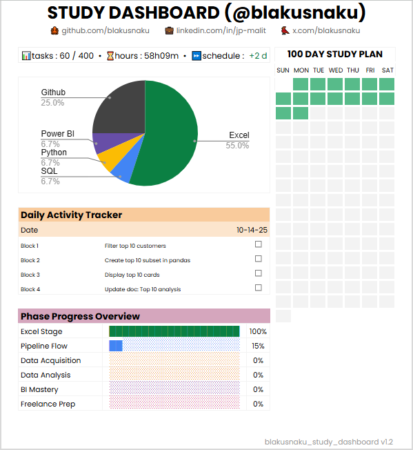

# 📊 Study Dashboard (@blakusnaku)
> Tracking the journey from Excel Foundations → SQL → Python → Power BI

---

## 🌐 Live View
> Access the latest interactive version (Google Sheets):  
👉 [View Live Dashboard](https://docs.google.com/spreadsheets/d/1TLP4skR9L8p8keZBImYdIXdy1Gyl0mBcUqyHPyfwIXE/edit?usp=sharing)

---



---

## 🧭 Overview
The **Study Dashboard** is a live analytics system built to visualize and monitor my data learning progress across 100 days.  
It tracks daily blocks, tasks, completion rates, and phase performance — turning my learning into measurable insights.

This dashboard connects the full learning pipeline:  
📊 **Excel (Foundations)** → 🧩 **SQL (Data Retrieval)** → 🐍 **Python (Transformation)** → ⚙️ **Power BI (Visualization)**

---

## 🔁 Pipeline Flow
| Stage | Description |
|--------|--------------|
| **Data Source** | Daily study log from Google Sheets (`Tasks` tab). |
| **Transformation** | Excel formulas + Power Query cleaning for consistency. |
| **Integration** | SQL joins replicated in Python (pandas) for validation. |
| **Visualization** | KPI dashboards in Power BI reflecting Excel and Python outputs. |

---

## 🧮 Core Metrics
| Metric | Description |
|--------|--------------|
| 🧩 **Total Tasks** | Total logged study activities across 100 days. |
| 📈 **Completion %** | Overall completion rate (auto-updated). |
| ⏱ **Total Hours** | Total study time accumulated. |
| 📅 **Schedule Variance** | Difference between actual vs. target schedule. |
| 🧮 **Phase Progress** | Visual progress by learning phase (Excel → SQL → Python → BI). |

---

## 🧩 Underlying Projects
This dashboard is powered by ongoing project data from my **100 Days of Data** series:  
🔗 [Explore the full pipeline → blakusnaku-100-days-of-data](https://github.com/blakusnaku/blakusnaku-100-days-of-data)

---

## 🗓️ Version History

### **📅 October 6, 2025 – Initial Concept**
**Theme:** Foundation Planning  
- Conceptualized a dashboard to track daily study blocks (Block 1–4).  
- Selected **Excel** as the primary environment for early versions.  
- Established a measurable **100-day learning goal**.  

---

### **📅 October 7, 2025 – Core Layout & Metrics**
**Theme:** Structure and Design  
- Added KPI metrics: Total Tasks, Completion %, Total Hours, Schedule Variance.  
- Created the **Daily Activity Tracker** and **16-week GitHub-style grid**.  
- Added **social icons (GitHub, LinkedIn, X)** for branding.  
- Finalized initial color hierarchy and structure.  

---

### **📅 October 8, 2025 – Version 1.0**
**Theme:** Official Baseline  
- Completed the first stable version: `blakusnaku_study_dashboard v1.0`.  
- Added **Phase Progress Overview** and finalized header polish.  
- Locked this as the **official starting baseline** for future builds.  
> 📍 *Milestone: “Excel Foundations Complete”*

---

### **📅 October 10, 2025 – Version 1.1**
**Theme:** Pipeline Flow + Power BI Focus  
- Refined KPIs into **one-line metrics** for cleaner layout.  
- Added **Tool Usage Pie Chart** and **Phase Progress Overview**.  
- Updated version label → `v1.1`.  
- Reorganized files into **daily folders** for GitHub readability.  
- Shifted focus to **Power BI integration** after analyzing skill demand.  
- Created the first cross-tool project:  
  🧩 *“Day 13 – SQL → Python → Power BI Sales Dashboard”*  
- Merged SQL, Python, and Power BI workflows — foundation for the “Pipeline Flow” phase.  

---

### **📅 October 11, 2025 – Version 1.2**
**Theme:** Integration & Versioned Baseline  
Version 1.2 marks the **official baseline release** of the Study Dashboard — merging design, functionality, and integration clarity across the full learning pipeline.

#### 🔧 Key Updates
- Established **v1.2** as the new official baseline for future dashboards.  
- Integrated a **web scraping module** into the 100-day plan for broader data handling.  
- Finalized **visual hierarchy** (Title 20 pt, KPI 36 pt) and standardized hex palette.  
- Enhanced **Phase Progress Overview** and improved KPI legibility.  
- Added a **version tag footer:** `blakusnaku_study_dashboard v1.2`.  
- Unified **Power BI design language** with Excel baselines.

#### 🧠 Focus
This version represents the **integration stage** — linking Excel, SQL, Python, and Power BI into a single trackable ecosystem.  
It serves as the **anchor point** for upcoming versions (v1.3 → v2.0), ensuring design and data consistency moving forward.

> _“From structure to integration — v1.2 marks the start of a unified data ecosystem.”_

---

## 📈 Current Stats (as of October 10, 2025)
| Metric | Value |
|--------|-------|
| Tasks Completed | 60 / 400 |
| Hours Logged | 58h 09m |
| Schedule Variance | +2 days ahead |
| Excel Stage | ✅ 100% |
| Pipeline Flow | 🚀 15% |
| Data Acquisition / Data Analysis / BI Mastery / Freelance Prep | 🔜 Upcoming |

---

## 🧾 File Structure
```
blakusnaku-study-dashboard/
│
├── assets/
│ ├── blakusnaku_study_dashboard_v1_0.png
│ ├── blakusnaku_study_dashboard_v1_1.png
│ └── blakusnaku_study_dashboard_v1_2.png
│
└── README.md
```

---

## 🔗 Study Dashboard Hub
| Project | Repository |
|----------|-------------|
| 📘 100 Days of Data | [blakusnaku-100-days-of-data](https://github.com/blakusnaku/blakusnaku-100-days-of-data) |
| 🧠 Analytics Portfolio | [blakusnaku-analytics-portfolio](https://github.com/blakusnaku/blakusnaku-analytics-portfolio) |

---

## 🏷️ Tags
`Excel Foundations` · `SQL Integration` · `Python Data Pipeline` · `Power BI` · `Dashboard Design` · `Learning Analytics` · `v1.2`

---

**Maintainer:** [@blakusnaku](https://github.com/blakusnaku)  
**Version Tag:** `blakusnaku_study_dashboard v1.2`  
**Last Updated:** October 11, 2025
